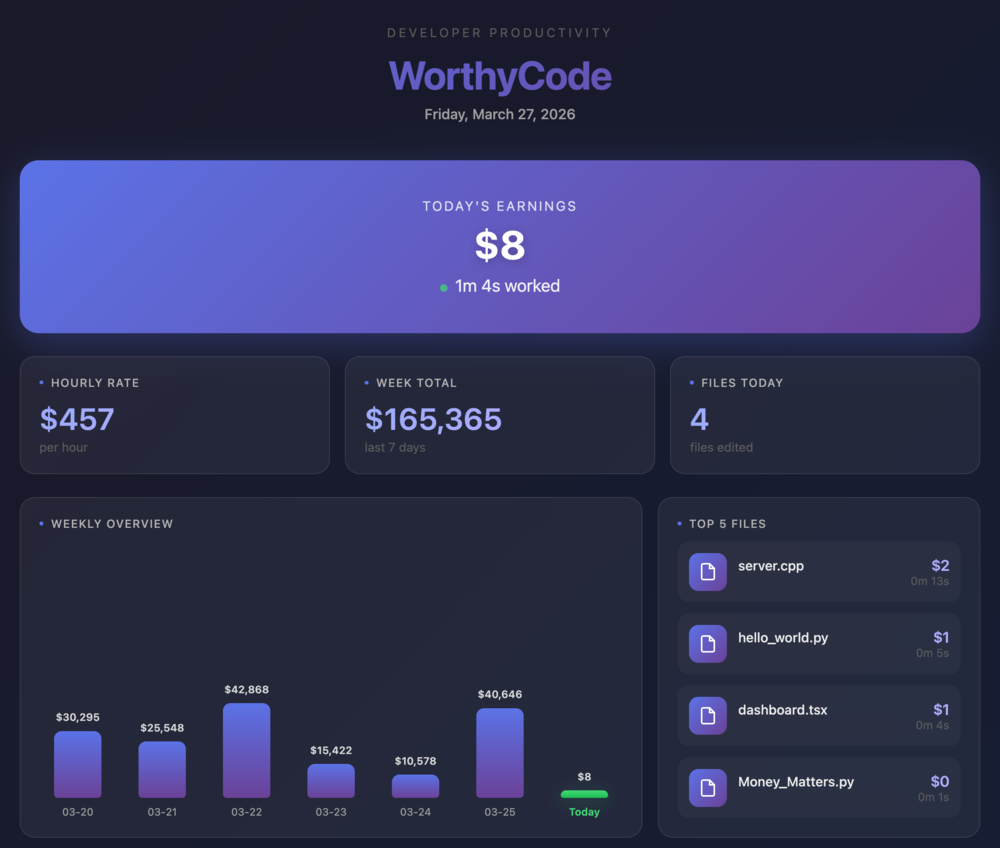

# WorthyCode

**Track the worth of your coding time.**

Ever wondered how much your coding time is worth? WorthyCode automatically tracks your development time and converts it to cost based on your hourly rate.

## Features

### Real-time Tracking

- Automatic time tracking with smart idle detection
- Status bar shows live worth and time
- Hover for quick stats preview

### Beautiful Dashboard

- **Today's Worth** - See your daily worth at a glance
- **Weekly Overview** - Bar chart of the past 7 days
- **Top 5 Files** - Click to open most worked files
- **File Extensions** - Donut chart breakdown by file type
- **Activity Heatmap** - GitHub-style yearly activity view

### Easy Configuration

- Set your hourly rate
- Customize idle timeout
- Choose your currency ($, KRW, EUR, GBP, JPY, CNY)

## Usage

1. Install the extension
2. Set your hourly rate in the sidebar
3. Start coding - tracking begins automatically!
4. Click the status bar to view your dashboard

## Commands

| Command                       | Description            |
| ----------------------------- | ---------------------- |
| `WorthyCode: Show Dashboard`  | Open full dashboard    |
| `WorthyCode: Reset Today`     | Reset today's stats    |
| `WorthyCode: Toggle Tracking` | Pause/resume tracking  |

## Settings

| Setting                  | Default | Description           |
| ------------------------ | ------- | --------------------- |
| `worthycode.hourlyRate`  | 10      | Your hourly rate      |
| `worthycode.idleTimeout` | 60      | Idle timeout (seconds)|
| `worthycode.currency`    | $       | Currency symbol       |

## Disclaimer

This is a productivity tool for visualizing the worth of your coding time.

## Privacy

All data is stored locally on your machine. No data is sent to any server.

## License

MIT

---

**Enjoy coding and track your productivity!**
